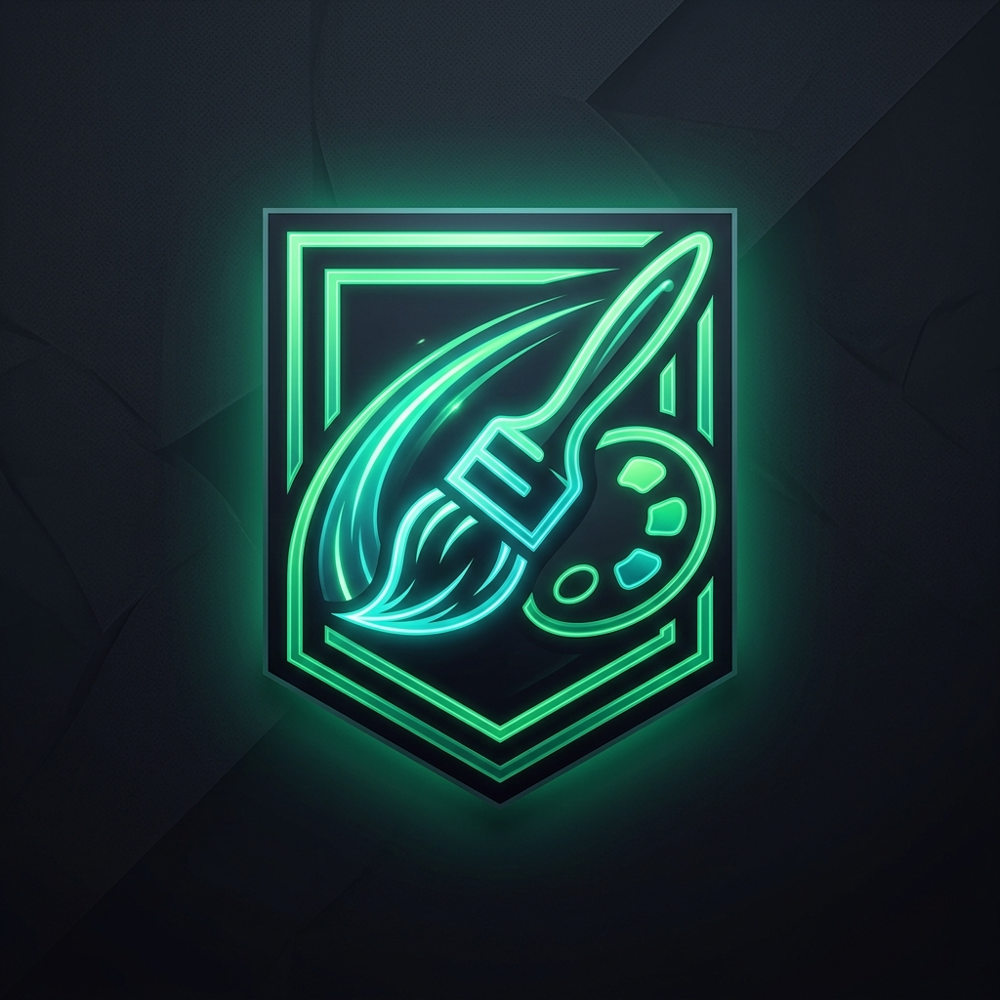

<div align="center">
  

<p align="center">
  <h1>🎬 Emby Artwork Studio</h1>
</p>
</div>


<p align="center">
  <strong>ES:</strong> Un estudio web completo para inyectar overlays y banners de alta calidad —4K, Dolby Vision, IMAX— y fondos personalizados directamente a tu servidor de Emby en segundos.<br>
  <strong>EN:</strong> A complete web studio to inject high-quality overlays and banners —4K, Dolby Vision, IMAX— and custom backdrops directly into your Emby server in seconds.
</p>

---

## 🇪🇸 Descripción (Español)

**Artwork Studio** es una herramienta de grado "Homelab" diseñada para llevar la experiencia visual de tu servidor Emby al siguiente nivel. A través de una interfaz moderna y fluida construida en Next.js, te permite escanear tu biblioteca, previsualizar carátulas, aplicar banners espectaculares (Dolby Vision, HDR10+, etc.) y buscar/establecer fondos de pantalla panorámicos (Backdrops) desde la base de datos de TMDb de forma sencilla.

### 🔌 ¿Cómo se conecta a Emby?
La aplicación interactúa directamente con la API REST oficial de tu servidor Emby:
1. **Librerías y Contenido**: Consulta las colecciones disponibles y lista los contenidos a través del endpoint `/emby/Library/SelectableMediaFolders` e `/emby/Items`.
2. **Aplicación de Posters/Banners**: Cuando seleccionas una carátula o aplicas un banner, la aplicación descarga el arte base de TMDb, lo redimensiona y superpone el overlay con la biblioteca de procesamiento de imágenes `sharp`, y finalmente lo sube a tu servidor Emby enviando la imagen codificada en Base64 al endpoint `/emby/Items/{Id}/Images/Primary`.
3. **Aplicación de Fondos (Backdrops)**: Permite elegir fondos panorámicos de TMDb y subirlos directamente como fondo de pantalla de la película en Emby mediante el endpoint `/emby/Items/{Id}/Images/Backdrop/0` en formato Base64.

### 🛡️ Medidas de Seguridad y Blindaje
GitHub público con total tranquilidad, se han implementado las siguientes protecciones de seguridad:
* **Separación de Entorno (.env y .env.example)**: Las claves reales de API y direcciones IP se configuran localmente mediante variables de entorno. El repositorio contiene solo `.env.example` con ejemplos genéricos libres de credenciales.
* **.gitignore Robusto**: Bloquea por completo cualquier archivo que contenga variables reales como `.env`, `.env.local`, `.env.production` y directorios temporales de Next.js (`.next/`).
* **Proxy Seguro de Imágenes (`/api/image-proxy`)**: El frontend nunca se conecta directamente a tu servidor Emby para mostrar las imágenes de las carátulas. En su lugar, todas las imágenes pasan por un proxy interno de Next.js. De esta forma, **las IPs locales y los tokens de tu API de Emby jamás quedan expuestos** en las etiquetas `` o en las peticiones de red del navegador del cliente.
* **Configuración del Cliente Desacoplada (LocalStorage & Cookies)**: La interfaz almacena tus preferencias de conexión localmente en tu navegador (`localStorage`) y las transmite mediante cookies seguras al servidor sólo cuando es necesario, evitando dejar secretos en el código fuente.

### 📋 Requisitos Previos
Para que la aplicación funcione, necesitas obtener estas claves y tener a mano la URL de tu servidor:
1. **Emby Server URL**: La dirección local donde se encuentra tu servidor (ej: `http://192.168.1.100:8096`).
2. **Emby API Key**: Generada desde el panel de control de Emby (`Ajustes > Claves de API > Nueva Clave API`).
3. **TMDb API Key (Opcional pero recomendado)**: Para enriquecer metadatos de las películas, consíguela registrándote gratis en [The Movie Database](https://www.themoviedb.org/).

### 🚀 Despliegue Rápido (Docker / Portainer)
La manera más rápida de tenerlo corriendo en tu servidor casero es usar `docker-compose`. Copia el siguiente bloque en tus Stacks de Portainer o en tu archivo `docker-compose.yml`:

```yaml
version: '3.8'

services:
  emby-artwork-studio:
    image: ghcr.io/TU_USUARIO/emby-artwork-studio:latest # O construye localmente con 'build: .'
    container_name: emby-artwork-studio
    restart: unless-stopped
    ports:
      - "3000:3000"
    environment:
      - NODE_ENV=production
      - EMBY_URL=http://TU_IP_LOCAL:8096
      - EMBY_API_KEY=tu_emby_api_key_aqui
      - TMDB_API_KEY=tu_tmdb_api_key_aqui
    healthcheck:
      test: ["CMD-SHELL", "wget --no-verbose --tries=1 --spider http://localhost:3000/ || exit 1"]
      interval: 30s
      timeout: 10s
      retries: 3
      start_period: 40s
    volumes:
      - /etc/timezone:/etc/timezone:ro
      - /etc/localtime:/etc/localtime:ro
```

Luego, accede a `http://<IP_DE_TU_SERVIDOR>:3000` en tu navegador.

---

## 🇬🇧 Description (English)

**Artwork Studio** is a "Homelab" grade tool designed to take your Emby server's visual experience to the next level. Through a sleek, modern UI built with Next.js, it allows you to scan your library, preview movie posters, apply gorgeous overlays (Dolby Vision, HDR10+, etc.), and search/apply widescreen backdrops from TMDb easily.

### 🔌 How it Connects to Emby
The application interacts directly with your Emby server's official REST API:
1. **Libraries and Content**: Retrieves available media collections and maps items via the `/emby/Library/SelectableMediaFolders` and `/emby/Items` endpoints.
2. **Poster and Banner Processing**: When applying an overlay, the application downloads the base poster from TMDb, resizes and layers the selected overlay badge using the `sharp` image library, and uploads the final output as a Base64-encoded string to `/emby/Items/{Id}/Images/Primary`.
3. **Widescreen Backdrops**: Downloads backdrop layouts from TMDb and posts them as movie backdrops to Emby via the `/emby/Items/{Id}/Images/Backdrop/0` endpoint using Base64.

### 🛡️ Security & Hardening Features
the following security measures have been built-in:
* **Separation of Environment (.env & .env.example)**: Real API keys and IP addresses are handled via local environment variables. The repository only tracks `.env.example` containing generic placeholders.
* **Hardened .gitignore**: Blocks files containing real configurations (`.env`, `.env.local`, `.env.production`) and build directories (`.next/`) to prevent accidental leaks.
* **Secure Image Proxy (`/api/image-proxy`)**: The frontend never communicates directly with your Emby server when loading movie images. Instead, all images pass through an internal Next.js proxy route. Consequently, **your local IPs and Emby API Keys are never exposed** in the client's image HTML tags or browser network requests.
* **Decoupled Client Config (LocalStorage & Cookies)**: Stores connection tokens locally in your browser (`localStorage`) and sends them to server actions dynamically via cookies only when required, keeping code files completely stateless and clean of secrets.

### 📋 Prerequisites
To get the app working, you need to grab these keys and have your server URL ready:
1. **Emby Server URL**: The local address where your server runs (e.g., `http://192.168.1.100:8096`).
2. **Emby API Key**: Generated from the Emby Dashboard (`Settings > API Keys > New API Key`).
3. **TMDb API Key (Optional but recommended)**: Used to enrich movie metadata, get it by registering for free at [The Movie Database](https://www.themoviedb.org/).

### 🚀 Quick Deployment (Docker / Portainer)
The fastest way to get it running on your home server is using `docker-compose`. Copy the following block into your Portainer Stacks or your `docker-compose.yml` file:

```yaml
version: '3.8'

services:
  emby-artwork-studio:
    image: ghcr.io/YOUR_USERNAME/emby-artwork-studio:latest # Or build locally with 'build: .'
    container_name: emby-artwork-studio
    restart: unless-stopped
    ports:
      - "3000:3000"
    environment:
      - NODE_ENV=production
      - EMBY_URL=http://YOUR_LOCAL_IP:8096
      - EMBY_API_KEY=your_emby_api_key_here
      - TMDB_API_KEY=your_tmdb_api_key_here
    healthcheck:
      test: ["CMD-SHELL", "wget --no-verbose --tries=1 --spider http://localhost:3000/ || exit 1"]
      interval: 30s
      timeout: 10s
      retries: 3
      start_period: 40s
    volumes:
      - /etc/timezone:/etc/timezone:ro
      - /etc/localtime:/etc/localtime:ro
```

Then, navigate to `http://<YOUR_SERVER_IP>:3000` in your browser.
